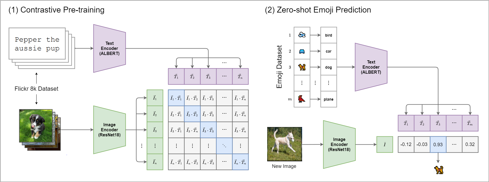

# Image2Emoji

This repository contains the code for Image2Emoji, a Zero-shot Emoji Prediction model. The model is based on OpenAI's CLIP model and is trained on [Flickr-8k Dataset](https://www.kaggle.com/datasets/adityajn105/flickr8k). The model is able to predict the most relevant emoji for a given image.

## 📎 Model
OpenAI's CLIP (Contrastive Language-Image Pretraining) model can embed different types of data into a common feature space by learning to predict which images correspond to which text descriptions.
I opted for lightweight models for each encoder (Pretrained ResNet18 for the image encoder and Pretrained ALBERT for the text encoder), aiming to deploy as a web application.
After training the model on the Flickr-8k dataset, the model is able to predict the most similar emoji for a given image by calculating the cosine similarity between the image and emoji embeddings.



## 📦 Installation
To install the required packages, run the following command:
```bash
pip install -r requirements.txt
```

## 📚 Dataset
Dataset used for training the model is Flickr-8k dataset. The dataset contains 8,000 images that are each paired with captions. Training pipeline expects the dataset to be in the following structure:
```bash
root
└── Flickr8k
        ├── images
        └── captions.txt
        
```

## 🏃 Constrastive Pre-training
The model is trained using a contrastive loss function. It is trained to maximize the similarity between an image and its corresponding caption while minimizing the similarity between an image and a random caption. The model is trained for 10 epochs with a batch size of 16.

## 🤔 Zero-shot Emoji Prediction
After Contrastive Pre-training, the model is able to predict the most similar emoji for a given image by calculating the cosine similarity between the image and emoji embeddings.

## 🗺️ Emoji Feature Space


## 📝 Refferences
- [CLIP Paper](https://arxiv.org/abs/2103.00020)
- [CLIP wandb Implementation](https://github.com/soumik12345/clip-lightning)
- [Flickr-8k Dataset](https://www.kaggle.com/datasets/adityajn105/flickr8k)
- [Emoji Dataset](https://huggingface.co/datasets/valhalla/emoji-dataset)

## ☑️ To-Do
- Train the model on a larger dataset Flickr-30k
- Train the model on a larger dataset MS-COCO
- Data Augmentation
- Emoji Feature Space